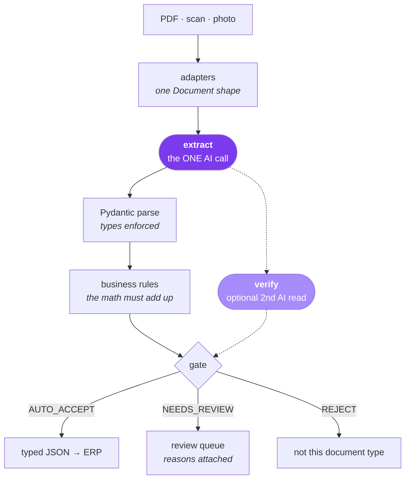

# ai-invoice-extractor

Schema-driven invoice extraction: a deterministic pipeline with exactly one
AI call (two, if you buy the verification pass), measured with evals. See
[SPEC.md](SPEC.md) for the full design.



Only the two purple seats are AI — judgment on unstructured input, and a
second opinion on the fields that move money. Everything else is code:
deterministic, testable, free. For the worked example (Iberia Home Goods,
~800 supplier invoices/month) the measured rates below extrapolate to
roughly **$7/month in API calls, ~97% of invoices posted untouched, and a
clerk reviewing ~25 flagged documents instead of retyping 800** — each
flagged one arriving with the reasons and both machine readings attached.

**Status:** build step 9 of 9 — the numbers are in the tables below;
next stop is the recording booth.

## Requirements

- Python 3.12 and [uv](https://docs.astral.sh/uv/)
- An **Anthropic API key** (the default provider). An OpenAI key is
  optional — only `--provider openai` and the cross-model evals need it.
- Pango, only if you want to *regenerate* the synthetic fixtures:
  `brew install pango` (macOS) or
  `apt install libpango-1.0-0 libpangocairo-1.0-0` (Debian/Ubuntu)

## Install

```bash
git clone <this repo> && cd ai-invoice-extractor
uv sync
cp .env.example .env    # then put your ANTHROPIC_API_KEY in it
```

## Run

There are two ways to use this repo.

**1. Follow the lessons** — the numbered scripts at the repo root are the
video chapters. Each one runs top-to-bottom as a plain script, or
cell-by-cell in the VS Code interactive window (select this project's
`.venv` as the kernel; ipykernel is already a dev dependency):

```bash
uv run python 1-ingestion.py
```

**2. Use the standalone tool** — point it at *any* invoice, yours included,
not just the bundled fixtures:

```bash
uv run python -m extractor path/to/invoice.pdf             # human-readable summary
uv run python -m extractor invoice.pdf --verify            # + a second AI read of the critical fields
uv run python -m extractor invoice.pdf --json > out.json   # full result as JSON, for pipes
uv run python -m extractor scanned-invoice.jpg             # images work too
uv run python -m extractor invoice.pdf --provider openai   # the other vendor
```

The exit code mirrors the decision — `0` AUTO_ACCEPT, `1` NEEDS_REVIEW,
`2` REJECT — so it scripts cleanly. A document that isn't an invoice gets
REJECTed, never half-extracted, and `--profile module:attr` swaps in a
different schema + rules to extract a different document type entirely.

## Walkthrough (video chapters)

The lessons live at the repo root, right next to the `extractor/` package
they import — so they run with zero path configuration. Chapters 2+ spend
money on API calls; **following the whole walkthrough costs well under
$0.25** — every cell that spends says so in its title.

1. [`1-ingestion.py`](1-ingestion.py) — input adapters: PDF, scan,
   and photo normalize into one `Document` shape
2. [`2-ai-inference.py`](2-ai-inference.py) — call the API: content
   + instructions in, plain text out — great until you try to parse it
3. [`3-structured-output.py`](3-structured-output.py) — the same
   call with a typed schema; prose → typed object
4. [`4-validation.py`](4-validation.py) — deterministic rules +
   confidence gate: AUTO_ACCEPT / NEEDS_REVIEW / REJECT, review queue as JSONL
5. [`5-prompt-chaining.py`](5-prompt-chaining.py) — a second, blind AI
   read of the fields that move money; code compares the two readings,
   a mismatch forces review
6. [`6-schema-swap.py`](6-schema-swap.py) — swap one profile file and the
   same pipeline reads delivery notes; the system was never about invoices
7. [`7-evals.py`](7-evals.py) — unit tests for AI, with an answer key:
   extract, grade, aggregate — the tables below come from the full runner

## The engine

The lessons demo concepts; this package owns the implementations.
The pipeline is generic; [`profiles/`](profiles/) holds everything
use-case-specific:

```python
from extractor import extract, verify
from profiles.iberia_invoice import IBERIA_INVOICE

result = extract("invoice.pdf", IBERIA_INVOICE)
result = verify(result, IBERIA_INVOICE)  # optional second AI read (chapter 5)
result.data        # typed IberiaInvoice instance (None on REJECT)
result.field_meta  # per-field confidence + flags
result.validation  # passed/failed business rules
result.cost        # tokens in/out + $ estimate
result.decision    # AUTO_ACCEPT | NEEDS_REVIEW | REJECT
```

- [`extractor/adapters.py`](extractor/adapters.py) — `DocumentLoader`:
  PDF/scan/photo → one `Document`
- [`extractor/providers/`](extractor/providers/) — the `LLMProvider`
  interface with `AnthropicProvider` and `OpenAIProvider` behind it
  (pricing single source per file; swapping LLMs = one new subclass,
  and nothing else in the repo changes — that's the proof)
- [`extractor/validate.py`](extractor/validate.py) — rule runner + locale-aware
  `Money` (accepts `1.234,56`)
- [`extractor/verify.py`](extractor/verify.py) — the optional verification
  step, chained after extraction (`verify(result, profile)`): a second,
  blind read of the critical fields; deterministic comparison, flags but
  never corrects
- [`extractor/gate.py`](extractor/gate.py) — rules + confidence → decision
- [`extractor/output.py`](extractor/output.py) — `ReviewQueue`: flagged
  documents land in a JSONL file with reasons attached
- [`extractor/__main__.py`](extractor/__main__.py) — the command line above:
  any document in, summary or JSON out, decision as exit code
- [`profiles/iberia_invoice.py`](profiles/iberia_invoice.py) — the worked
  example: schema + 6 business rules + gate policy (SPEC §4)
- [`profiles/delivery_note.py`](profiles/delivery_note.py) — the swap:
  one page of schema + rules turns the same engine into a delivery-note
  reader (chapter 6)

Rules and gate are plain code, so they get plain tests:
`uv run pytest tests/test_validation.py` (no API key needed).

## Evals — measured, improved, re-measured (build steps 4–7)

Every document is scored against a verified answer key: the truth sidecars
in [`fixtures/truth/`](fixtures/truth/), cross-checked against the rendered
PDFs by [`evals/verify_gold.py`](evals/verify_gold.py). **You don't need to
run the evals** — the results are committed here. If you change the system,
`uv run python evals/run_evals.py` reproduces them (`--verify` for the
ablation row, `--provider openai` for the other vendor, `--verify-provider`
to have one vendor check the other): it prints the estimated cost and asks
before spending, and caches every extraction so re-runs with unchanged
prompts/model are free.

### How to read the numbers

The corpus is 43 documents: 37 single invoices, 2 concatenated
multi-invoice PDFs, and 4 documents that are not invoices at all. Every
configuration below is the same engine over the same corpus; only the
models change. The columns:

- **fully correct** — invoices where all 12 extracted fields match the
  answer key. Measures the *reader*.
- **gate error** — of the invoices the gate AUTO_ACCEPTed (posted with no
  human look), how many had at least one wrong field. Measures the
  *system*; this is the number a CFO cares about, because every one of
  these lands in the ERP as-is.
- **reviews (false alarms)** — invoices routed to a human, and how many of
  those were actually fine. Reviews are the cost of safety; false alarms
  are wasted clerk time.
- **$/doc** — average API cost per document for that configuration.

"With verification" always means the same thing (chapter 5): after
extraction, a **second AI call re-reads only the critical fields** —
vendor name, vendor tax id, invoice number, total — *blind*, without
seeing the first call's answers. Code compares the two readings; any
mismatch drops that field's confidence and forces NEEDS_REVIEW. The
verifier never edits the data.

### claude-haiku-4-5 — the default

| metric | extraction only | with verification |
|---|---|---|
| fully correct documents | 35/37 | 35/37 |
| per-field accuracy | 97–100% | 97–100% |
| reject docs correctly refused | 4/4 | 4/4 |
| **gate error** | **2/37 (5.4%)** | **1/36 (2.8%)** |
| reviews (false alarms) | 0 | 1 (0) |
| cost per document | $0.0074 | $0.0088 |

Accuracy doesn't move between the columns — the verifier flags, it never
corrects — but gate error halves: the one-letter vendor misread that
sails past a single read gets caught by the second and lands in review
with both readings attached.

The eval's whole point is watching numbers move when the system changes:

| gate error (auto-accepted docs with any error) | baseline | + verification |
|---|---|---|
| build step 4 — first measured baseline | 8.1% | — |
| build step 5 — verification pass | 8.1% | 2.9% |
| build step 6 — field-description fixes | 5.4% | 2.8% |

Step 6 fixed the two failure classes prompts *can* fix, by sharpening field
descriptions in [`profiles/iberia_invoice.py`](profiles/iberia_invoice.py):
vendor/customer confusion on the German scans (the vendor is "the party
that ISSUED the invoice — letterhead, logo, bank details", not the
prominent customer block) and quantity markers glued onto line-item
descriptions ("'10 Stk.' belongs in quantity").

### gpt-5.4-mini — OpenAI's small tier (July 2026), the fair peer

| metric | extraction only | with verification |
|---|---|---|
| fully correct documents | 28/37 | 28/37 |
| reject docs correctly refused | 4/4 | 4/4 |
| **gate error** | **9/37 (24.3%)** | **9/37 (24.3%)** |
| reviews (false alarms) | 0 | 0 |
| cost per document | $0.0036 | $0.0045 |

Half Haiku's price, nine more wrong documents — and it auto-accepts every
one of them, because it never doubts itself. Worse: verification by itself
catches **zero** of those nine errors. A highly self-consistent model
re-reads its way into the same mistakes, so the second call just buys the
same opinion twice.

### gpt-4o-mini — the 2024 budget floor

| metric | extraction only | with verification |
|---|---|---|
| fully correct documents | 24/37 | 24/37 |
| reject docs correctly refused | 4/4 | 4/4 |
| **gate error** | **9/33 (27.3%)** | **2/23 (8.7%)** |
| reviews (false alarms) | 4 (0) | 14 (3) |
| cost per document | $0.0011 | $0.0017 |

The cheapest configuration on the page and the worst reader. Verification
does cut its gate error — but by drowning the clerk: 14 of 37 invoices go
to review. When the reader is weak, the safety net becomes the workload.

### All configurations, compared

Read each row as: *[extractor] reads the document; [verifier] re-reads the
critical fields blind; code compares.*

| extractor | verifier | fully correct | gate error | reviews (false) | $/doc | what it shows |
|---|---|---|---|---|---|---|
| `claude-haiku-4-5` | — | 35/37 | 5.4% | 0 | $0.0074 | the best reader still lets 2 scan misreads through |
| `claude-haiku-4-5` | `claude-haiku-4-5` | 35/37 | **2.8%** | 1 (0) | $0.0088 | a second read by the same model halves escapes |
| `claude-haiku-4-5` | `gpt-5.4-mini` | 35/37 | **2.8%** | 1 (0) | $0.0083 | a peer from another vendor is just as good a witness |
| `claude-haiku-4-5` | `gpt-4o-mini` | 35/37 | 3.2% | 6 (5) | $0.0080 | a weaker witness hurts: 5 false alarms, missed the real error |
| `gpt-5.4-mini` | — | 28/37 | 24.3% | 0 | $0.0036 | half the price, 9 more errors, all auto-posted |
| `gpt-5.4-mini` | `gpt-5.4-mini` | 28/37 | 24.3% | 0 | $0.0045 | self-consistent model: the second opinion IS the first |
| `gpt-4o-mini` | — | 24/37 | 27.3% | 4 (0) | $0.0011 | cheapest and worst |
| `gpt-4o-mini` | `gpt-4o-mini` | 24/37 | 8.7% | 14 (3) | $0.0017 | the net works, but 14/37 docs land on the clerk's desk |

The conclusions in one breath: **pick the strongest small reader you can
afford** (the extra $0.004/doc is the cheapest line item in a system that
exists to save clerk time), and **buy the second opinion from a reader at
least as good — ideally a different one** (two different models agreeing
is the strongest evidence here; the same model agreeing with itself may
mean nothing at all).

Swapping providers also surfaced two vendor quirks, both absorbed at the
validation boundary without touching the engine: `gpt-4o-mini` reports the
*string* `"null"` for a not-applicable confidence even in strict-schema
mode, and copies quantity columns verbatim (`"4 Stk."`) — which the same
locale-aware parsing that handles `1.234,56` now swallows too.

### What remains, honestly

- **Single-letter scan misreads (2 docs):** on the two noisiest scans the
  model drops a letter from the vendor's name on one ("Küchenprof") and
  doubles a letter in a line-item description on the other ("Auflauffform").
  Prompts can't fix pixels. The name misread is on a critical field, so
  verification catches it → review; the line-item one isn't — it IS the
  remaining 2.8%. Widening the critical set is a thresholds-vs-cost
  decision, not a code change.
- **Multi-invoice PDFs (t08, known limitation):** auto-accept with only one
  of two invoices extracted, until the multi-invoice adapter heuristic
  lands. (One of the two now trips verification by luck — the two reads
  picked different invoices — but the fix belongs in the adapter.)

## Fixtures (SPEC §5.5 failure matrix)

43 synthetic PDFs (41 invoice records + 4 reject docs) across 12 layout
templates, generated as HTML → PDF with truth sidecars. The size is set by
the eval: 41 records × 12 fields ≈ 490 field comparisons keeps the headline
accuracy table stable (one error ≈ 0.2%), with 3+ documents per
failure-matrix row — bigger buys little, smaller makes gate quality
anecdotal.

```
uv run python fixtures/generate.py   # regenerate (deterministic, seed 20260711)
uv run pytest                        # smoke tests: counts, arithmetic, determinism
```

| Template | Covers |
|---|---|
| t01/t02 Spanish clean & dense | baseline, European decimals, mixed IVA rates |
| t03/t04 Portuguese & German | intra-EU reverse-charge VAT |
| t05 Chinese exporter | US decimals, USD/CNY, non-EU tax id |
| t06 minimalist English | missing fields (no due date) → `None` |
| t07 multi-page | 2–3 page invoices |
| t08 concatenated PDF | two invoices in one attachment |
| t09 simulated scans | rotated, noisy, no text layer |
| t10 handwritten annotations | scrawls + distractor amount over printed values |
| r1/r2 statement & quote | must be REJECTed, not extracted |

`fixtures/docs/other/` holds one generated delivery note — outside the
eval corpus (no truth sidecar) — for the chapter-6 schema swap.
`fixtures/photo/` holds a real photographed receipt (user-provided, not
generated) for the chapter-1 adapter demo. All generated docs are internally
consistent by design — seeded extraction errors are simulated in code in
chapter 4, never baked into documents (see `fixtures/gen/__init__.py`).


## Deliberately out of scope

PO matching, approval routing, GL coding, ERP integration, OCR-model
training, email ingestion, and any UI. Those are the systems *around* this
one, and naming them is the point: a real AP pipeline is mostly integration
work, and none of it needs AI. This repo builds the one piece that does.

The restraint is the lesson. This workflow is fixed, known in advance, and
linear — so it's a *system* with one AI call in it, not an agent. You reach
for an agent when the next step genuinely depends on what the previous one
found: a vendor dispute to investigate, a mismatched PO to chase across
systems, an exception with no playbook. Reading a document isn't that.
That's the next video.
